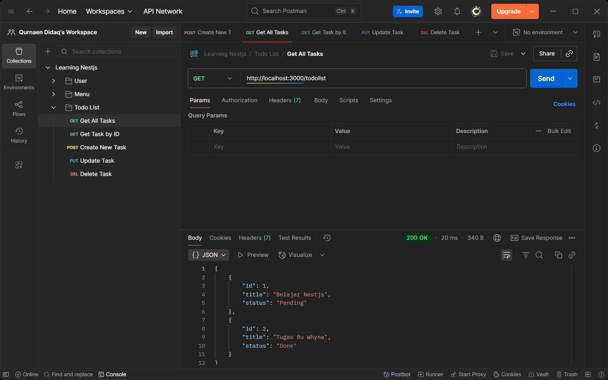
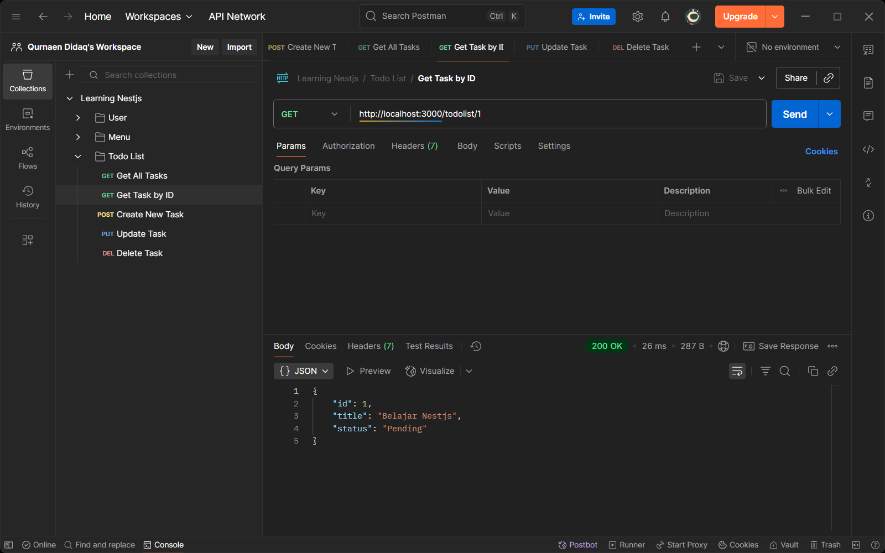
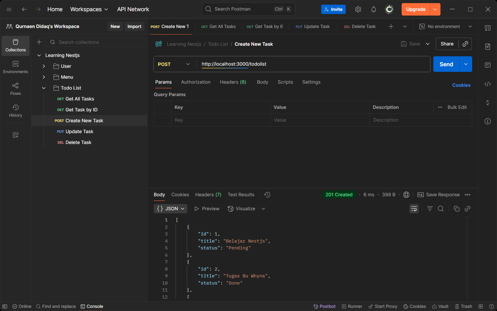
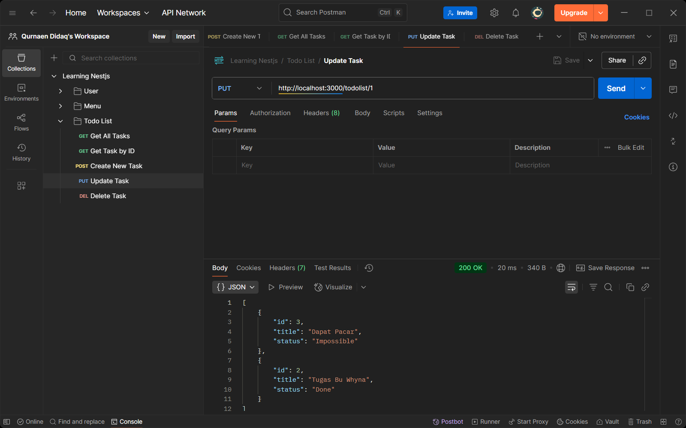
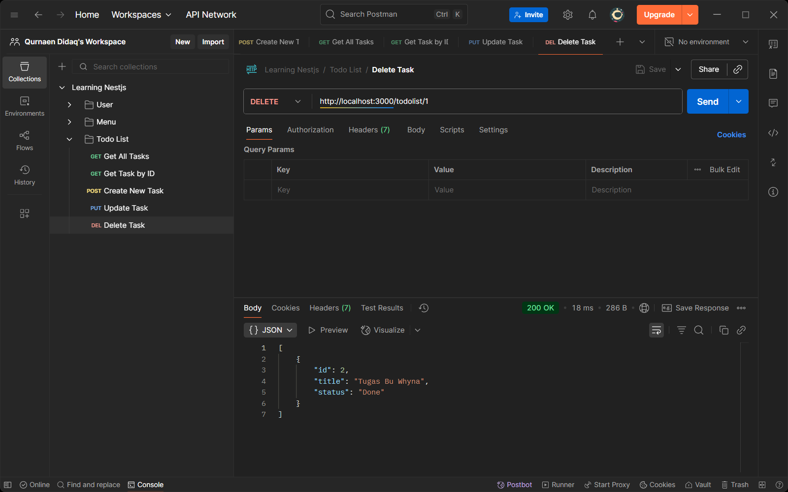

# Simple Todo List NestJS

### Identitas
Nama: Qurnaen Didaq  
Kelas: XI RPL 1

### Deskripsi Singkat API
API ini berfungsi sebagai daftar pekerjaan yang harus dikerjakan. Terdapat fungsi dengan format Create, Read, Update, Delete (CRUD).

### Daftar Endpoint
- GET /todolist → *Menampilkan semua todo*
  
- GET /todolist/:id → *Menampilkan todo berdasarkan ID*
  
- POST /todolist → *Menambah todo baru*
  
- PUT /todolist/:id → *Mengupdate todo berdasarkan ID*
  
- DELETE /todolist/:id → *Menghapus todo berdasarkan ID*
  
